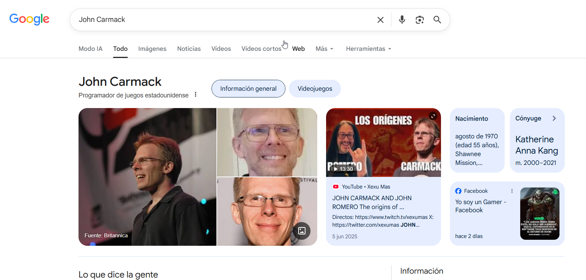

# Caso práctico - Búsqueda de información sobre una persona con Google

## Objetivo

Obtener información pública sobre una persona utilizando Google y operadores de búsqueda.

## Herramienta utilizada

- Google

## Escenario

Se investigará a la siguiente persona:

```text
John Carmack
```

---

## Paso 1. Realizar una búsqueda general

Accede a Google y busca el nombre completo de la persona.

```text
John Carmack
```



---

## Paso 2. Buscar el perfil de LinkedIn

Utiliza el operador `site:` para localizar su perfil profesional.

```text
site:linkedin.com "John Carmack"
```


---

## Paso 3. Buscar noticias

Obtén información publicada en medios de comunicación.

```text
"John Carmack" news
```


---

## Resultados obtenidos

Durante la investigación pueden encontrarse:

- Sitios web oficiales.
- Perfiles profesionales.
- Entrevistas y noticias.

---

## Conclusiones

Google permite recopilar rápidamente información pública sobre una persona mediante el uso de operadores de búsqueda. La combinación de búsquedas generales y operadores como `site:` o `filetype:` facilita localizar perfiles, documentos y otros recursos relevantes para una investigación OSINT.