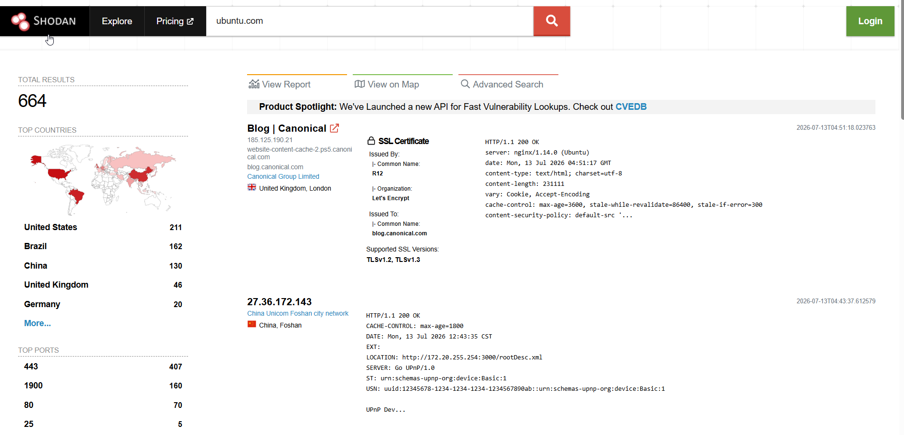

# Caso práctico - Análisis de un dominio con Shodan

## Objetivo

Obtener información pública sobre la infraestructura de un dominio utilizando Shodan.

## Herramienta utilizada

- Shodan

## Escenario

Se analizará el dominio:

```text
ubuntu.com
```

---

## Paso 1. Buscar el dominio

Accede a Shodan e introduce el dominio **ubuntu.com** en el buscador.



---

## Paso 2. Analizar los resultados

Shodan devuelve **664 resultados**, correspondientes a distintos servicios relacionados con el dominio.

Entre la información disponible se encuentra:

- Direcciones IP.
- Ubicación geográfica.
- Organización propietaria.
- Certificados SSL.
- Puertos abiertos.
- Servicios detectados.
- Cabeceras HTTP.
- Fecha del último escaneo.

---

## Paso 3. Revisar un servicio

Seleccionando uno de los resultados es posible consultar información técnica como:

- Dirección IP.
- Puerto.
- Servicio detectado.
- Banner.
- Certificado SSL.
- Tecnologías utilizadas.
- Sistema operativo (cuando está disponible).

---

## Conclusiones

Shodan permite identificar rápidamente la infraestructura pública asociada a un dominio y conocer los servicios expuestos en Internet, facilitando el reconocimiento inicial durante una investigación OSINT.