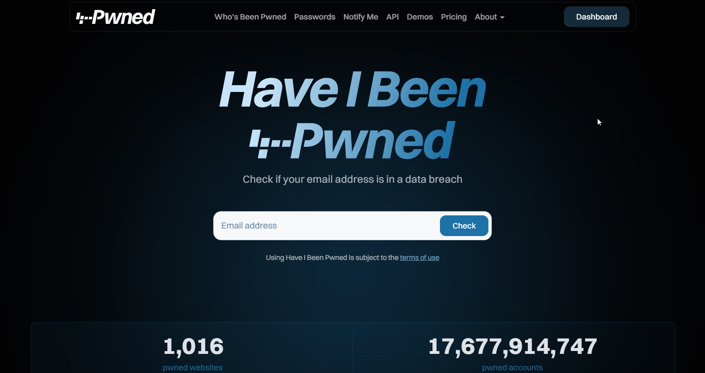
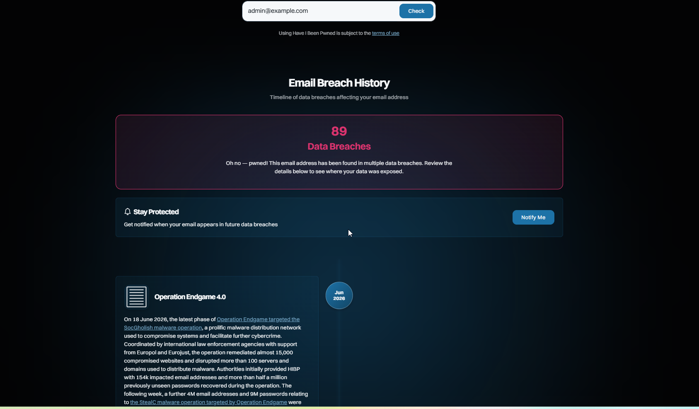

# Caso práctico - Comprobación de una dirección de correo con Have I Been Pwned

## Objetivo

Comprobar si una dirección de correo electrónico ha aparecido en alguna brecha de datos conocida.

## Herramienta utilizada

- Have I Been Pwned

## Escenario

Se analizará la siguiente dirección de correo:

```text
example@example.com
```

---

## Paso 1. Acceder a Have I Been Pwned

Abre la página principal de Have I Been Pwned.



---

## Paso 2. Introducir la dirección de correo

Escribe la dirección de correo en el buscador y pulsa **"pwned?"**.

```text
admin@example.com
```



---

## Resultados obtenidos

Durante la consulta pueden obtenerse datos como:

- Existencia de filtraciones.
- Número de brechas.
- Servicios afectados.
- Tipo de información comprometida (contraseñas, nombres, teléfonos, direcciones, etc.).

---

## Conclusiones

Have I Been Pwned permite verificar de forma rápida si una dirección de correo electrónico ha sido comprometida en filtraciones de datos públicas. Esta información resulta útil para evaluar el nivel de exposición de una cuenta y determinar si es recomendable cambiar la contraseña o revisar otras medidas de seguridad.